# CODI-IT ERD

> Generated by [`prisma-markdown`](https://github.com/samchon/prisma-markdown)

- [User](#user)
- [Grade](#grade)
- [Store](#store)
- [FavoriteStore](#favoritestore)
- [Product](#product)
- [Category](#category)
- [Stock](#stock)
- [Size](#size)
- [Inquiry](#inquiry)
- [Reply](#reply)
- [Review](#review)
- [Cart](#cart)
- [CartItem](#cartitem)
- [Order](#order)
- [OrderItem](#orderitem)
- [Payment](#payment)
- [Alarm](#alarm)
- [default](#default)

## User

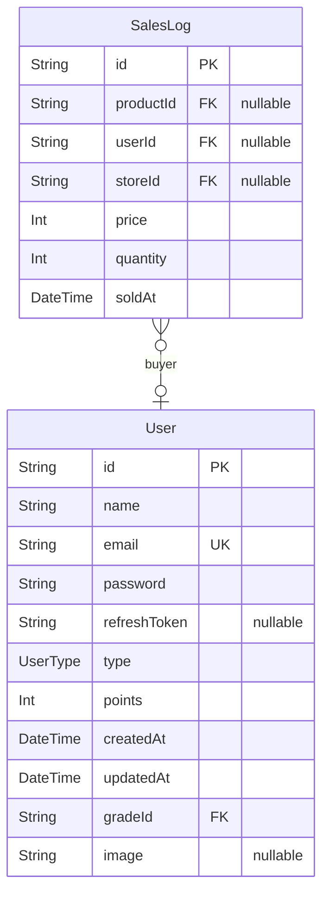

### `User`

유저 모델입니다.

Properties as follows:

- `id`: 유저 KEY ID
- `name`: 유저 이름
- `email`: 유저 이메일
- `password`: 유저 비밀번호 (hash)
- `refreshToken`:
- `type`: 유저 타입
- `points`: 유저 포인트
- `createdAt`: 유저 생성일
- `updatedAt`: 유저 정보 업데이트일
- `gradeId`: 등급 정보 (nullable)
- `image`: 기본 값 : https://sprint-be-project.s3.ap-northeast-2.amazonaws.com/codiit/1749477485230-user_default.png

### `SalesLog`

판매 기록 통게 모델입니다.

Properties as follows:

- `id`:
- `productId`:
- `userId`:
- `storeId`:
- `price`:
- `quantity`:
- `soldAt`:

## Grade

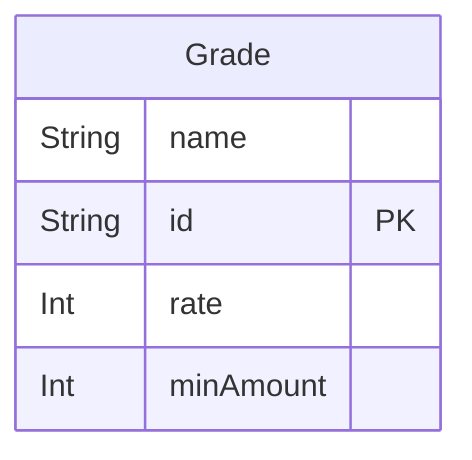

### `Grade`

등급 모델입니다.

Properties as follows:

- `name`: 등급 이름
- `id`: 등급 ID
- `rate`: 할인율
- `minAmount`: 달성 최소 금액

## Store

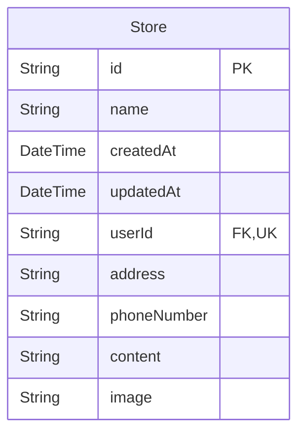

### `Store`

스토어 모델입니다.

Properties as follows:

- `id`: 스토어 ID
- `name`: 스토어 이름
- `createdAt`: 스토어 생성일
- `updatedAt`: 스토어 정보 업데이트일
- `userId`: 스토어 소유자 유저 ID
- `address`: 주소
- `phoneNumber`: 전화번호
- `content`: 스토어 설명
- `image`: 가게 이미지 URL

## FavoriteStore

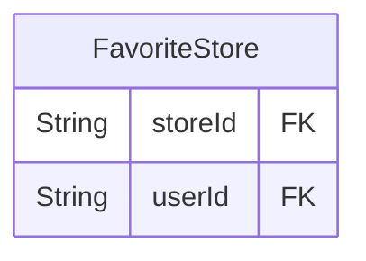

### `FavoriteStore`

관심 스토어 모델입니다.

Properties as follows:

- `storeId`: 스토어 ID
- `userId`: 유저 ID

## Product

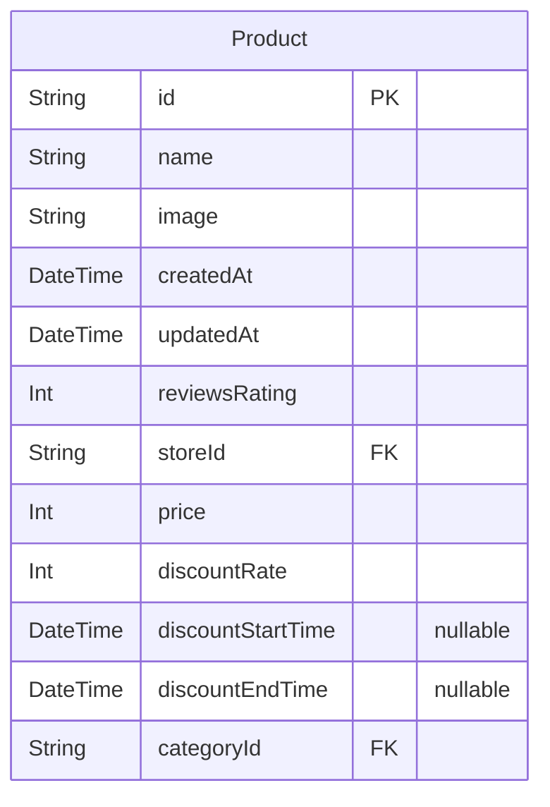

### `Product`

상품 모델입니다.

Properties as follows:

- `id`: 상품 ID
- `name`: 상품 이름
- `image`: 상품 이미지 URL
- `createdAt`: 생성일
- `updatedAt`: 수정일
- `reviewsRating`: 평균 리뷰 평점
- `storeId`: 스토어 ID
- `price`: 정가
- `discountRate`: 할인율(%)
- `discountStartTime`: 할인 시작 날짜 (nullable)
- `discountEndTime`: 할인 종료 날짜 (nullable)
- `categoryId`: 카테고리 정보

## Category

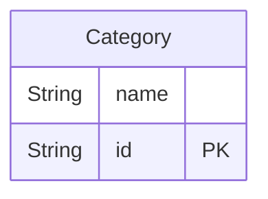

### `Category`

카테고리 모델입니다.

Properties as follows:

- `name`:
- `id`:

## Stock

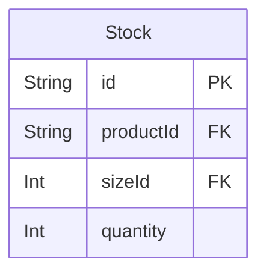

### `Stock`

재고 모델입니다.

Properties as follows:

- `id`:
- `productId`:
- `sizeId`:
- `quantity`:

## Size

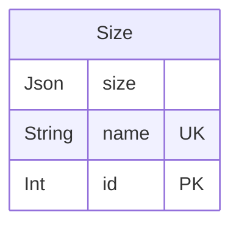

### `Size`

사이즈 모델입니다.

Properties as follows:

- `size`: 다국어 지원을 위해 Json 을 사용합니다.
- `name`:
- `id`:

## Inquiry

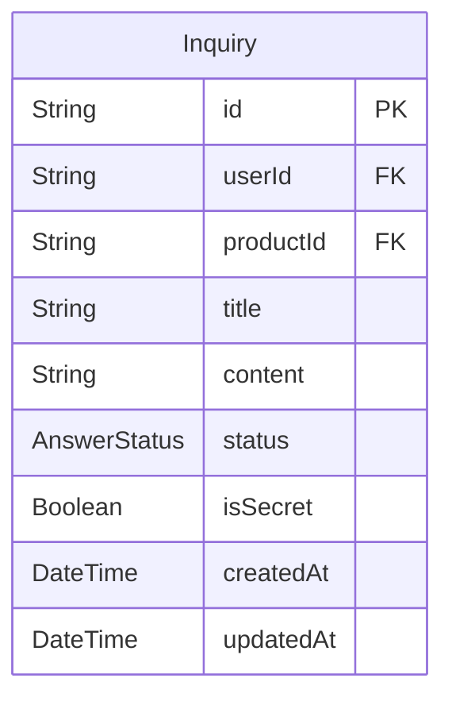

### `Inquiry`

문의 모델입니다.

Properties as follows:

- `id`:
- `userId`:
- `productId`:
- `title`:
- `content`:
- `status`: 문의 처리 상태를 enum 으로 표시합니다.
- `isSecret`: 비밀글 설정을 할 수 있습니다.
- `createdAt`:
- `updatedAt`:

## Reply

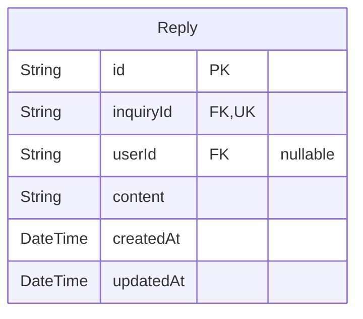

### `Reply`

답변 모델입니다.

Properties as follows:

- `id`:
- `inquiryId`:
- `userId`:
- `content`:
- `createdAt`:
- `updatedAt`:

## Review

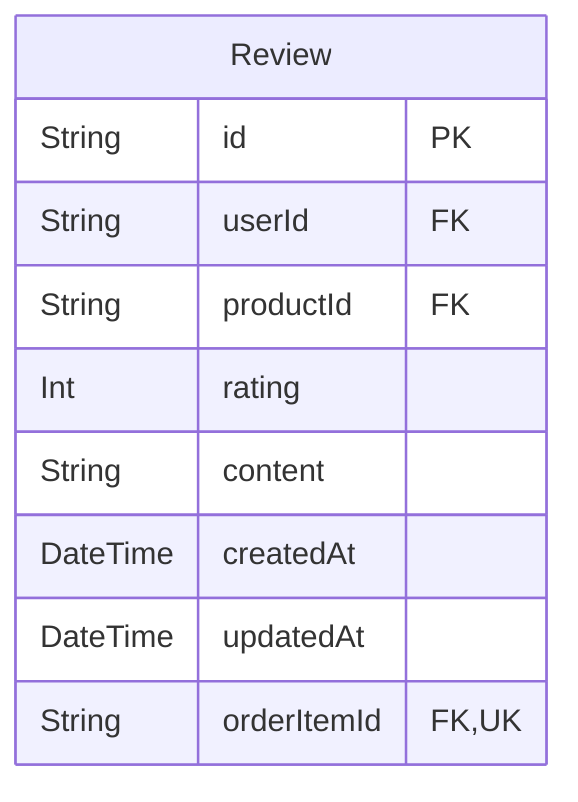

### `Review`

리뷰 모델입니다.

Properties as follows:

- `id`:
- `userId`:
- `productId`:
- `rating`:
- `content`:
- `createdAt`:
- `updatedAt`:
- `orderItemId`:

## Cart

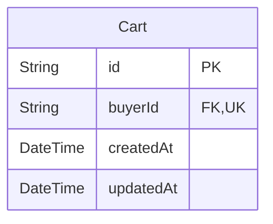

### `Cart`

장바구니 모델입니다.

Properties as follows:

- `id`:
- `buyerId`:
- `createdAt`:
- `updatedAt`:

## CartItem

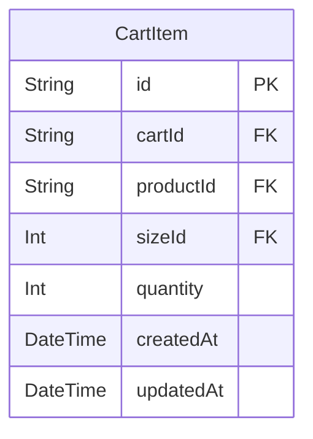

### `CartItem`

장바구니에 담긴 아이템 모델입니다.

Properties as follows:

- `id`:
- `cartId`:
- `productId`:
- `sizeId`:
- `quantity`:
- `createdAt`:
- `updatedAt`:

## Order

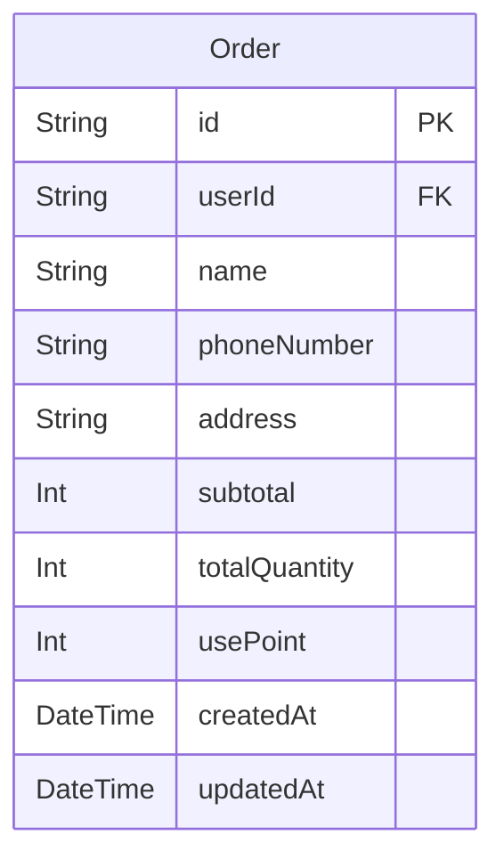

### `Order`

주문 모델입니다.

Properties as follows:

- `id`:
- `userId`:
- `name`:
- `phoneNumber`:
- `address`:
- `subtotal`: 포인트를 제외한 상품 가격의 총합
- `totalQuantity`:
- `usePoint`:
- `createdAt`:
- `updatedAt`:

## OrderItem

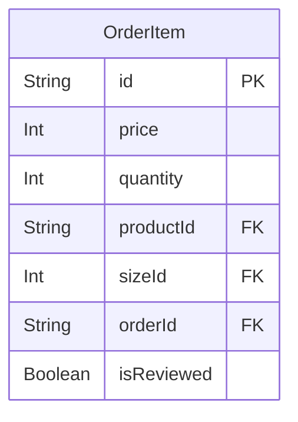

### `OrderItem`

주문한 아이템 모델입니다.

Properties as follows:

- `id`:
- `price`:
- `quantity`:
- `productId`:
- `sizeId`:
- `orderId`:
- `isReviewed`: 리뷰 썼는지 안썼는지 체크하는 boolean

## Payment

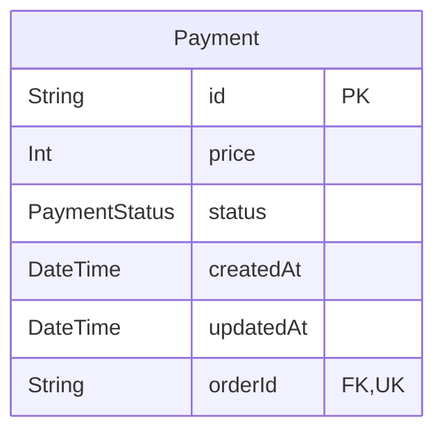

### `Payment`

결제 모델입니다.

Properties as follows:

- `id`:
- `price`:
- `status`: 결제 상태를 enum 으로 체크합니다.
- `createdAt`:
- `updatedAt`:
- `orderId`:

## Alarm

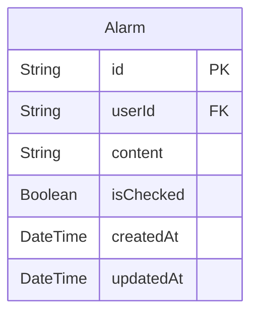

### `Alarm`

알림 모델입니다.

Properties as follows:

- `id`:
- `userId`:
- `content`:
- `isChecked`: 알림을 읽었는지 boolean 으로 체크합니다.
- `createdAt`:
- `updatedAt`:

## default

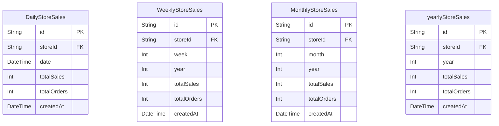

### `DailyStoreSales`

Properties as follows:

- `id`:
- `storeId`:
- `date`:
- `totalSales`:
- `totalOrders`:
- `createdAt`:

### `WeeklyStoreSales`

Properties as follows:

- `id`:
- `storeId`:
- `week`:
- `year`:
- `totalSales`:
- `totalOrders`:
- `createdAt`:

### `MonthlyStoreSales`

Properties as follows:

- `id`:
- `storeId`:
- `month`:
- `year`:
- `totalSales`:
- `totalOrders`:
- `createdAt`:

### `yearlyStoreSales`

Properties as follows:

- `id`:
- `storeId`:
- `year`:
- `totalSales`:
- `totalOrders`:
- `createdAt`:
